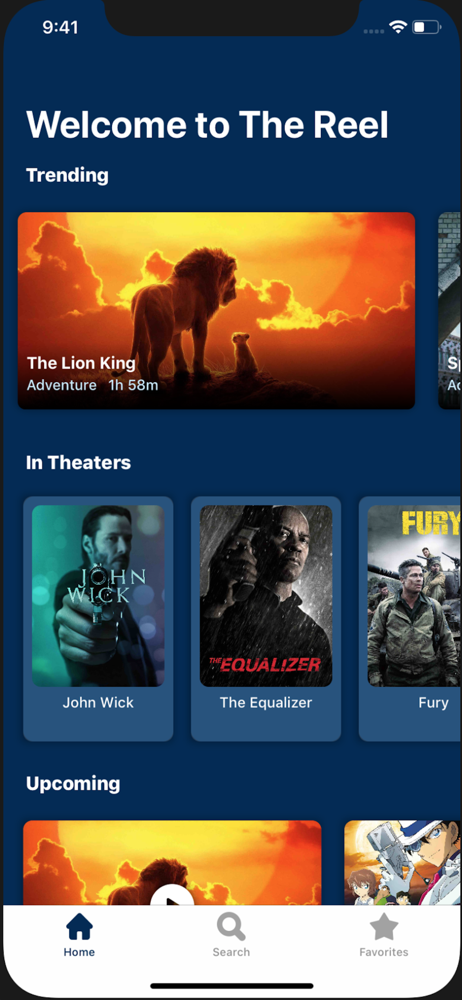
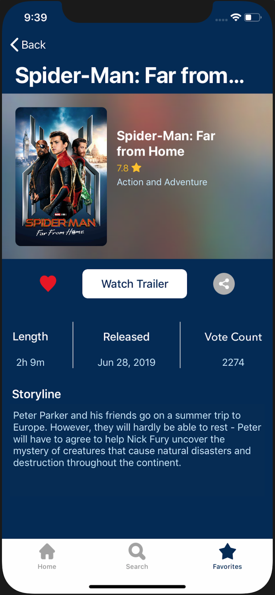
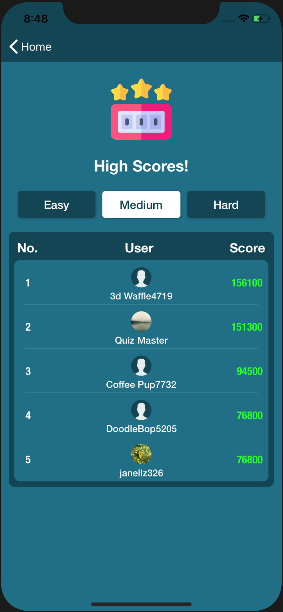

# Portfolio

  <h1>The Reel</h1>
  

     |
     |
    
  

  

    
<b>Overview: </b> This app allows users to check the latest movie titles along with trailers, overviews, and ratings.

    
<b>Role: </b> I was solely responsible for this app from its design to deployment.

    
<b>Tools: </b> Swift 4, The Movie Database API

    
<b>Inspiration/design: </b>  Sketch, Dribble

  

 

  <h1>Thinker's Delight</h1>
  

     |
     |
    
  

  

    
<b>Overview: </b> This app offers a trivia based four select categories and three difficulties. Users three attempts and 30 seconds to answer each question. If they score high enough, they can make it to the Top 5!

    
<b>Role: </b>  I was solely responsible for this app from its design to deployment.

    
<b>Tools: </b>  Swift 5, Firebase, OpenTriviaDB API

    
<b>Inspiration/design: </b>  Sketch, Dribble

  

